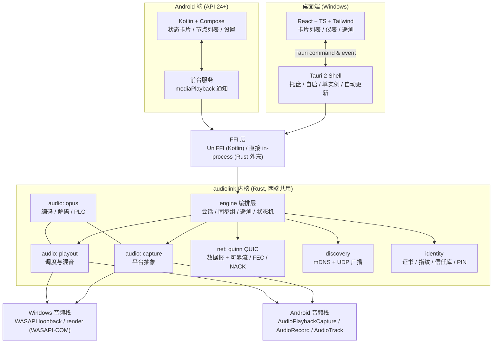

# AudioLink 总体架构

> 配套文档：`01-requirements.md`（需求）、`03-protocol.md`（协议）、`04-tech-stack.md`（选型）
> 设计原则：**实时路径零分配、跨端一套内核、平台差异只在抽象层、可观测即功能**

---

## 1. 架构总览



**关键取舍**：

1. **内核用 Rust 写一次，两端共用**（FR-09/10/20 的实现基础）。协议、编解码、抖动缓冲、时钟同步、混音、发现、配对全在内核；Kotlin 与 Tauri 只做 UI + 平台音频出/入口 + 系统集成。
2. **平台音频用"抽象层 + 平台实现"**：内核定义 `CaptureSource` / `PlayoutSink` trait；Windows 实现走 WASAPI（COM），Android 实现由 Kotlin 侧提供（`AudioRecord` / `AudioTrack` / `MediaProjection`）并通过 JNI 回调把 PCM 推给内核。
3. **不做"内核托管播放线程"的反转**：Android 侧 `AudioTrack` 的生命周期与线程亲和性必须在 Kotlin 侧管理（避免 JNI 跨线程播放的经典坑），内核只输出"PCM + 目标播放时刻 + 期望速率"。
4. **无 HTTP 服务面**（旧版最大攻击面）：节点间通信只走 QUIC，本地不监听任何明文端口。

---

## 2. 代码组织（monorepo）

```
AudioLink/
├─ Cargo.toml                     # Rust workspace 根（成员：core/crates/* + desktop/src-tauri）
├─ rust-toolchain.toml            # 锁定工具链（可复现构建）
├─ .cargo/config.toml             # 目标与交叉编译约定
├─ core/
│  └─ crates/
│     ├─ audiolink-types/         # 协议常量、枚举、错误码、遥测指标结构（默认零依赖；`serde` 为可选依赖，仅由 proto 开启）
│     ├─ audiolink-proto/         # 帧/命令/发现报文 编解码 + 测试向量（golden vectors）；L1 严格解码层（非法帧一律 BadRequest 且不 panic，见 03-protocol.md §1.1）
│     ├─ audiolink-audio/         # 采集/播放抽象、重采样、Opus、抖动缓冲、混音器
│     ├─ audiolink-net/           # quinn QUIC 会话、数据报通道、FEC/NACK、时钟同步
│     ├─ audiolink-discovery/     # mDNS/DNS-SD + UDP 广播兜底
│     ├─ audiolink-identity/      # 自签证书、指纹、信任库、PIN 配对状态机
│     ├─ audiolink-engine/        # 编排：引擎、会话管理、同步组、遥测、事件总线
│     ├─ audiolink-ffi/           # UniFFI 导出（供 Kotlin/其他语言调用）
│     └─ audiolink-tools/         # alp2-dump / latency-probe / soak-runner
├─ desktop/                       # Tauri 2 桌面端
│  ├─ src-tauri/                  # Rust 外壳：命令、托盘、自启、更新、日志
│  └─ src/                        # React + TS + Tailwind UI
├─ android/                       # Kotlin + Compose 应用
│  ├─ app/                        # UI、前台服务、平台音频实现、JNI 桥
│  └─ scripts/build-rust.ps1      # cargo-ndk 交叉编译内核 → jniLibs
├─ docs/                          # 本目录：需求 / 架构 / 协议 / 选型 / 路线图 / 环境 / 迁移 / UI / 对标
├─ tools/                         # 开发辅助：版本一致性校验、延迟测量、双机录音对齐
└─ .github/workflows/             # CI：rust-check / android / desktop / release
```

> workspace 根放在仓库根（而非 `core/`），这样 Tauri 外壳 `desktop/src-tauri` 与内核共享同一套依赖解析与 `Cargo.lock`。

**依赖方向（单向，禁止反向）**：
`types → proto → audio/net/discovery/identity → engine → ffi → {desktop/src-tauri, android}`

`audio` 与 `net` 之间不互相依赖；两者只依赖 `types`/`proto`；`engine` 负责把它们拼起来。

---

## 3. 核心领域模型

```rust
// audiolink-types（示意，非最终签名）

/// 节点身份：由自签证书指纹确定，配对后进入信任库
pub struct NodeId(pub [u8; 32]);          // SHA-256(cert DER)

pub struct NodeInfo {
    pub id: NodeId,
    pub name: String,                      // 用户可改，仅展示用
    pub platform: Platform,                // Windows / Android
    pub caps: Capabilities,                // 位图：可发送 / 可接收 / 支持内录 / 支持混音…
    pub proto_version: u16,
    pub endpoints: Vec<SocketAddr>,        // QUIC 端点
}

/// 会话：一个发送方向一个接收方推的一"束"音频
pub struct Session {
    pub id: SessionId,
    pub source: StreamId,                  // 采集流（立体声/左/右/麦克风/内录）
    pub sink: NodeId,
    pub codec: Codec,                      // Opus{bitrate, frame_ms} | Pcm16
    pub group: Option<SyncGroupId>,        // 属于哪个同步组
    pub state: SessionState,               // Idle→Handshaking→Streaming→Degraded→Reconnecting
}

/// 接收侧的一条音频流（可来自不同发送端）
pub struct InboundStream {
    pub stream_id: StreamId,
    pub peer: NodeId,
    pub format: AudioFormat,               // 48k/f32/2ch（内核统一）
    pub jitter: JitterBuffer,
    pub gain: f32,
    pub mute: bool,
}
```

**统一内部音频格式**：`48_000 Hz / f32 / 2ch`（交错）。所有采集源（48k/44.1k/16k、单声道、24bit）在进入内核时统一重采样/上混到该格式；所有编码器与混音器只处理这一种格式。理由：混音与时钟同步只需一套算术，避免旧版"到处是采样率分支"的复杂度。

---

## 4. 实时路径与线程模型

```
[采集回调/线程]  WASAPI loopback / AudioRecord / MediaRecorder
      │  原始帧（可能非 48k）           ← 实时优先级，绝不做分配/加锁/日志
      ▼
[audio::capture]  重采样 → 48k/f32/2ch → 环形缓冲（无锁 SPSC）
      ▼
[audio::chunker]  切 20ms 帧 → opus 编码（内核工作线程池）
      ▼
[net::sender]     组装数据报（seq/ts/stream_id）→ quinn 发送
      ▼                        ▲
[net::receiver]  ◄─────────────┘  （对端）
      ▼
[net::jitter]     抖动缓冲 + 重排 + PLC 请求
      ▼
[audio::mixer]    多路求和 → 软限幅
      ▼
[audio::playout]  计算目标播放时刻（本地校正时钟）
      ▼
[平台 sink]       Windows: WASAPI render ｜ Android: Kotlin AudioTrack
```

| 线程/任务 | 职责 | 纪律 |
|---|---|---|
| 采集线程（平台拥有） | 抓原始帧 → 快速投递 | 不分配、不加锁、不日志、不阻塞 |
| 编码线程池（`engine` 拥有） | Opus 编码、重采样 | 允许分配；有界队列，满则丢最旧帧（策略可配） |
| 网络运行时（tokio 多线程） | QUIC 收发、时钟探测、FEC/NACK | 不与音频线程共享锁 |
| 播放调度（`audio::playout`） | 按目标时刻产出 PCM 块 | 单调时钟 `Instant`，禁止 `SystemTime` 参与调度 |
| 平台 sink（Kotlin/WASAPI） | 提交 PCM 到硬件 | 由内核给出"目标时刻 + 速率"指令 |
| 遥测聚合（`engine`） | 采样指标 → UI 事件 | 每 500 ms 一次，写入无锁环形缓冲 |

**实时路径铁律**（对应旧版"异常即永久静音"的根治）：
1. 音频线程内 `unwrap()` 被 lint 禁止；所有失败路径显式返回并计数。
2. 任一环节错误必须上报 `engine` → 触发状态机迁移（`Degraded`/`Rebuilding`），绝不允许"静默停止"。
3. **看门狗**：接收侧若检测到链路正常但 ≥ 2 s 无 PCM 输出，强制重建 sink（FR-28）。

---

## 5. 传输层设计（QUIC）

| 通道 | QUIC 载体 | 用途 | 可靠性 |
|---|---|---|---|
| **控制流** | 双向可靠流 #0（每连接一条） | 握手、命令、配对、同步组指令、遥测上报 | 可靠、有序、带请求 ID |
| **音频通道** | QUIC **数据报**（RFC 9221，`quinn` `send_datagram`） | Opus/PCM 帧 + 序号 + 时间戳 | 不可靠、可重排，靠 seq/ts + 抖动缓冲 + PLC 兜底 |
| **时钟探测** | 数据报（专用类型）+ 控制流回显 | NTP-like 采样 | 不重传（样本越多越好，取最小 RTT） |

选择理由：QUIC 提供 TLS1.3 加密、连接迁移（换 Wi-Fi 不断流）、无队头阻塞；数据报避免"音频包被可靠流重传拖后腿"。详见 `03-protocol.md` §3。

**拥塞控制**：音频数据报跟随 BBR（quinn 默认），但**发送侧同时做应用层自适应**——按丢包/延迟动态改 Opus 码率（160→128→96 kbps），必要时降帧长（20 → 10 ms，代价是包率翻倍）或降声道（立体声 → 单声道）。

---

## 6. 同步与预约播放

目标：组内 ±10 ms（FR-22）。

```
发送端（会话 owner）           接收端 A / B / C
   │ 1. 时钟探测（≥8 次，取最小 RTT 样本）
   ├──────────────────────────►  估计 offset = 对端时钟 − 本地时钟（误差 < 2 ms）
   │ 2. 分配会话 epoch（公共时间基准 T0，单位 ms，取自发送端单调时钟）
   ├──────────────────────────►
   │ 3. 每个音频包携带 (stream_id, seq, sample_index, T0)
   ├──────────────────────────►
                                  本地播放时刻 = local(T0) + sample_index / 48000
                                  → 调度到该时刻提交，而非"收到就播"
```

**三重保障**：
1. **时钟同步**（内核）：NTP-like 最小 RTT 过滤 + 中位数 + 单调时钟漂移估计（线性回归），输出 `offset` 与 `drift_ppm`，偏差 > 5 ms 时重新收敛。
2. **预约播放**：接收端用一个**固定深度的播放环**（默认 40 ms），播放指针由 epoch 驱动而非到达时间驱动 → 网络抖动不改变出声时刻。
3. **漂移校正**：当本地时钟与发送端时钟的漂移导致缓冲水位缓慢变化时，用**亚毫秒级速率微调**（重采样 ±0.05%）吸收，避免周期性丢帧/插帧的"咔哒"声；水位超安全边界才做整帧级修正。

> 与旧版对比：旧版是"收到就播 + 每 1.5 s 事后 seek 拉平"（误差 = 链路非对称量，且有可听瑕疵）；AudioLink 是"时间戳调度 + 事前对齐"。

**抖动缓冲目标算法（借鉴 Jamulus 的生产实现；注意：crates.io 上三个同名 crate 全部不可用，必须自研）**：
1. 同时维护 **10 个"仿真缓冲"**（深度 2–11 个数据块），在真实收发上并行记账；
2. 选 **误差率 ≤ 0.0005 的最小深度**作为目标深度：**初始固定 25 ms**，自适应时硬夹在 **[15, 60] ms**（稳定档上限 80 ms）；
3. 深度调整使用**不对称 IIR（升慢降快）+ 0.1 块迟滞**，避免抖动导致缓冲反复伸缩；
4. **时钟漂移必须每秒结算**：200 ppm 晶振 = 12 ms/分钟 = **每 2 分钟就耗光 25 ms 缓冲** → 每秒做 ±1~2 帧的丢/补结算（或亚毫秒级速率微调），否则 8 h soak 必然失败（NFR-05）。

**当前 M2 第一阶段（2026-09-16 已落地）**：先以 P95 到达间隔抖动和欠载驱动 20 / 40 / 60 ms 三档深度；升档立即，连续稳定 30 s 后逐档下降。60 ms 档才启用一帧有界重排；升档按实际水位缺口重缓冲且最多 60 ms，降档只丢真实多余深度。10 个仿真缓冲、误差率选深度、IIR 与漂移微调仍按上面的目标算法继续实现。详见 `docs/18-m2-adaptive-jitter.md`。

**数据面必须单播**（RFC 9119 明确：802.11 组播以基础速率发送、无 ACK/无重传、受省电模式影响）→ 音频只走单播 QUIC 数据报；组播仅用于 mDNS 发现，且必须保留 UDP 广播与手工 IP 兜底。

---

## 7. 混音架构（FR-12）

```
多路 InboundStream ──► 每路独立：抖动缓冲 → Opus 解码 → 增益/静音 → 声道映射
                                    │
                                    ▼
                        求和（f32，48k，2ch）
                                    │
                         软限幅（软膝 limiter，防削波）
                                    │
                              单路输出到 sink
```

- 每路独立 `gain`（0.0–2.0）与 `mute`，求和后限幅；限幅阈值 −1 dBFS，攻击时间 1 ms、释放 50 ms。
- 各路**必须**先对齐到同一 epoch（由各自发送端时钟同步到本地时钟后换算），否则混音会出现相位/时差拍频。
- 路数上限配置项（默认 8，超过则拒绝新流并回明确错误码）。

---

## 8. 发现与配对

```
mDNS/DNS-SD（主）                      UDP 广播（兜底）
_audiolink._udp.local                  端口 58280（可配）
TXT: v=1;id=<fingerprint8>;caps=..;pk=<port>   载荷: 版本+长度前缀+JSON
        │                                        │
        └──────────────► 候选节点列表 ◄──────────┘
                             │
                    连接（QUIC，自签证书）
                             │
              指纹在白名单？ ── 是 ──► 直接建会话（0 交互）
                     │
                     否
                     ▼
           PIN 配对：接收端显示 6 位码 → 发送端输入 → 双方落库白名单
```

- 身份 = 证书指纹（SHA-256），首次信任即 TOFU；PIN 用于防"同网段静默配对"。
- 白名单持久化：桌面 `%APPDATA%\AudioLink\trust.json`；Android 应用私有目录（`filesDir`）。
- 撤销信任立即断开现有会话（FR-18）。

---

## 9. 配置与持久化

| 项 | 桌面端 | Android |
|---|---|---|
| 目录 | `%APPDATA%\AudioLink\` | `filesDir`（应用私有） |
| 配置 | `config.json`（含采样率、编码档位、设备别名、窗口状态） | DataStore/JSON |
| 身份 | `identity\cert.pem` + `key.pem`（key 用 DPAPI 或文件权限保护） | KeyStore 保护私钥 |
| 信任库 | `trust.json` | 私有目录 JSON |
| 日志 | `%LOCALAPPDATA%\AudioLink\logs\`（滚动 7 天） | `filesDir/logs`（滚动，可导出） |

写入一律**原子写**（临时文件 + rename），避免断电产生半截配置（旧版直接 `File.WriteAllText` 覆盖）。

---

## 10. 可观测性（FR-32 的数据基础）

内核为每个会话维护指标结构（固定字段，便于两端统一展示）：

| 指标 | 含义 | 用途 |
|---|---|---|
| `rtt_ms` | QUIC 平滑 RTT | 网络体检 |
| `clock_offset_ms` / `drift_ppm` | 与发送端时钟的偏差与漂移 | 同步质量 |
| `jitter_ms`（P50/P95） | 到达间隔抖动 | 缓冲深度决策 |
| `loss_pct` | 数据报丢失率 | 码率自适应输入 |
| `bitrate_kbps` | 实际编码码率 | 带宽验证 |
| `buffer_level_ms` | 播放环水位 | 欠载预警 |
| `underruns` | 播放欠载次数 | 稳定性 |
| `e2e_latency_ms` | 估算端到端延迟（采集时间戳 → 预计出声时刻） | **验收主指标** |
| `plc_count` / `nack_count` | 丢包隐藏/重传次数 | 弱网表现 |

导出：CSV/JSON 快照 + CSV 时间序列（含 P50/P95/P99 汇总），日志脱敏（不含音频内容，不含网络标识之外的个人信息）。

---

## 11. 错误处理与状态机

```
Idle ──connect──► Handshaking ──ok──► Streaming ──loss/latency──► Degraded
                     │                   │                          │
                  失败│                断链│                       恶化│
                     ▼                   ▼                          ▼
                  Failed ◄─────────Reconnecting ──ok──► Streaming(Rebuilt)
```

- 所有错误收敛到 `AudioLinkError` 枚举（`types` crate），带 `code`(u16) + `context` 字段，跨 FFI 直接可用。
- **禁止空 catch**：Rust 侧 `#[deny(unused_must_use)]`，Kotlin 侧 lint 规则 `EmptyCatchBlock` 提升为 error，桌面 TS 侧 `no-floating-promises`。
- 错误必须"要么处理、要么上报"，不允许"假装没发生"（旧版哲学的反面）。

---

## 12. 技术债登记（已知、显式受理）

| 项 | 说明 | 触发条件 |
|---|---|---|
| `targetSdk` 停留在 36 | Android 17（API 37）强制 `ACCESS_LOCAL_NETWORK` 运行时权限；升 37 需同步实现权限门禁与降级引导 | 用户量证明必要时 |
| FGS while-in-use 合规 | targetSdk ≥ 37 时后台播放要求；届时需声明并验证 | 同上 |
| QUIC 数据报的 MTU 与分片策略 | 包体 > 1200 B 时需应用层分片，当前按 Opus 20 ms/160 kbps ≈ 400 B 预留余量 | 码率档 > 512 kbps 或 10 ms 帧 + 高码率 |
| 组播在部分 AP 上被隔离 | mDNS 失效场景靠 UDP 广播兜底；广播也被隔离则需手工加 IP | 已内置手工添加入口 |
| 便携版自动更新 | 便携版（非安装版）自动更新需额外处理文件占用 | M4 |
