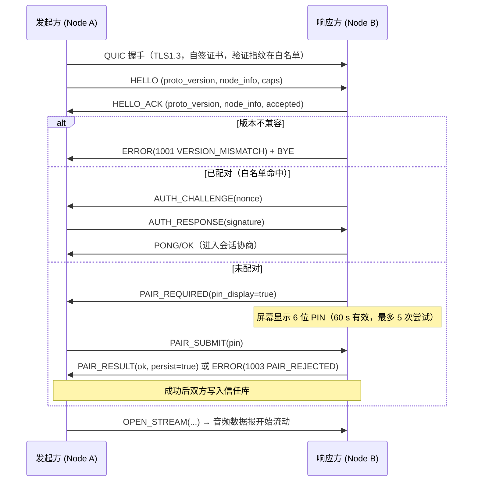

# AudioLink 传输协议 v2（ALP/2）

> 状态：**设计冻结 v1**（对应 `proto_version = 0x0201`）
> 目标：多设备同步、低延迟、可演进、加密、可测试。
> 与旧版关系：**不兼容**（旧版魔数 `picapico-audio-share` + 裸 TCP 的控制面不再支持）。

---

## 1. 术语与约定

| 术语 | 含义 |
|---|---|
| **Node（节点）** | 一个 AudioLink 实例（桌面或 Android），身份由自签证书指纹确定 |
| **Peer（对端）** | 已完成配对与握手的另一个节点 |
| **Session（会话）** | 一次"发送方向接收方推音频"的逻辑关系，1 对 1 |
| **Stream（流）** | 会话内的一条音频通道（立体声/左/右/麦克风/内录） |
| **Sync Group（同步组）** | 一个发送端 + N 个接收端，共享同一 `epoch`，组内 ±10 ms |
| **epoch** | 同步组公共时间基准（单调时间轴上的一个点），用于预约播放 |

**编码约定**：
- 所有整数字段**小端**（LE）；
- 时间字段为 **i64/u64 微秒**，基于**单调时钟**（`QueryPerformanceCounter` / `elapsedRealtimeNanos`），不使用挂钟；
- 所有变长字段带显式长度；
- **未知类型必须忽略而非报错**（旧版教训：协议不可演进）—— 注意：该规则是 **L2 分发层** 的行为，见 §1.1。
- 保留字段填 0；接收方不得依赖其为 0。

### 1.1 非法帧的两层处置（v1，消除「忽略 vs 拒绝」的歧义）

本节是 L1/L2 分层的唯一权威定义，§12 的拒绝用例与 `audiolink-proto` 的实现以此为准。

- **L1 严格解码层**（`audiolink-proto` 的 `decode*` 函数）：以下输入一律返回 `Err(1008 BAD_REQUEST)`，**绝不 panic**：
  长度不足 / 超出上限、`payload_len` 与剩余字节不符、版本字节 ≠ `0x02`、`ptype` 不在 §3 表内、
  `flags` 的 bit 5–15 任一非 0、ptype 定长载荷长度不符（见 §3 载荷表）、`AUDIO` 空载荷但未置 `DTX`（见 §3 载荷表）。
  本层是 golden vectors（§12）与「Android / 桌面共用同一内核」的跨端一致性契约面：**严格是为了让两端漂移在 CI 立刻暴露**。
- **L2 分发层**（`audiolink-engine`，v1 起实现）：收到 `BadRequest`，或解码成功但 `ptype` / 命令码不在自身实现范围时，
  **计数并丢弃该帧，不中断会话、不向对端回报错误**（§13 演进策略）。
- **结论**：上文「未知类型必须忽略而非报错」是 **L2 的行为**，§12「必须拒绝」是 **L1 的返回值**；二者不矛盾
  —— **禁止把 L1 的 `Err` 升级为断连或用户可见报错**。新增 `ptype` / 新 flags 位只由新版发送端使用，
  旧版的表现是「丢弃该帧（计数）」，音频侧由 PLC / 静音填充兜底（§8.1），不影响既有流。
- 为便于握手阶段识别主版本差异，控制帧额外提供**宽容信封解析**（只做结构校验，不校验 `ver` / `type`），
  上层据此决定是否回 `1001 VERSION_MISMATCH`；**严格解码**仍要求 `ver == 0x02` —— 该宽容入口仅用于握手，不用于数据面。

**端口**（均可配置）：
| 用途 | 端口 | 说明 |
|---|---|---|
| QUIC（所有节点共用） | **58290**/udp | 监听 + 发起同一端口 |
| mDNS | 5353/udp | 标准组播 |
| UDP 广播兜底发现 | **58280**/udp | 明文 JSON，仅用于发现 |

---

## 2. 传输映射（QUIC）

| 载体 | ID | 语义 | 用途 |
|---|---|---|---|
| 双向可靠流 | `#0` | 有序可靠 | 控制命令、认证、配对、流协商、遥测上报 |
| QUIC 数据报 | — | 不可靠、可重排 | 音频帧、时钟探测、心跳 |
| 单向可靠流 | `#2+` | 有序可靠 | 大对象传输（日志导出、诊断快照），v1 可选 |

TLS1.3（quinn 默认 rustls）：
- 每节点首次启动生成 **自签证书**（ECDSA P-256）并持久化；
- 节点身份 = `SHA-256(证书 DER)`，取前 16 字节作展示短码（`fp16`）；
- 握手**不依赖 CA**：证书验证改为"校验指纹是否在信任库 / 是否为本次配对目标"（TOFU + PIN）。

---

## 3. 音频数据报格式

```
 0                   1                   2                   3
+-+-+-+-+-+-+-+-+-+-+-+-+-+-+-+-+-+-+-+-+-+-+-+-+-+-+-+-+-+-+-+-+
|   version(1)  |   ptype(1)    |           flags(2)            |
+-+-+-+-+-+-+-+-+-+-+-+-+-+-+-+-+-+-+-+-+-+-+-+-+-+-+-+-+-+-+-+-+
|                        stream_id (u32)                        |
+-+-+-+-+-+-+-+-+-+-+-+-+-+-+-+-+-+-+-+-+-+-+-+-+-+-+-+-+-+-+-+-+
|                          seq (u32)                            |
+-+-+-+-+-+-+-+-+-+-+-+-+-+-+-+-+-+-+-+-+-+-+-+-+-+-+-+-+-+-+-+-+
|                    sample_index (u32)                         |
+-+-+-+-+-+-+-+-+-+-+-+-+-+-+-+-+-+-+-+-+-+-+-+-+-+-+-+-+-+-+-+-+
|                        epoch_id (u64)                         |
|                                                               |
+-+-+-+-+-+-+-+-+-+-+-+-+-+-+-+-+-+-+-+-+-+-+-+-+-+-+-+-+-+-+-+-+
|                payload (可变长度，≤ 1200 B)                    |
+---------------------------------------------------------------+
```

| 字段 | 类型 | 说明 |
|---|---|---|
| `version` | u8 | `0x02`（ALP 主版本）；不匹配 → 忽略并记数 |
| `ptype` | u8 | 见下表 |
| `flags` | u16 | 见下 |
| `stream_id` | u32 | 会话内唯一，`OPEN_STREAM` 时分配 |
| `seq` | u32 | 每流单调 +1，用于丢包检测与重排 |
| `sample_index` | u32 | 该负载首样本在 **epoch 基准**下的样本序号（48 kHz 计），用于预约播放 |
| `epoch_id` | u64 | 会话/组基准标识；会话重建后换新值 |
| `payload` | bytes | Opus 帧 或 PCM16LE 裸片 |

**ptype**：
| 值 | 名称 | 说明 |
|---|---|---|
| `0x01` | `AUDIO` | 音频负载 |
| `0x02` | `FEC` | 冗余包（XOR 组） |
| `0x03` | `CLOCK_PROBE` | 时钟探测请求（载荷：`probe_seq(u32)` + `t1(i64)`） |
| `0x04` | `CLOCK_REPLY` | 探测应答（`probe_seq(u32)` + `t1(i64)` + `t2(i64)` + `t3(i64)`） |
| `0x05` | `KEEPALIVE` | 心跳（无载荷，`flags` 可带状态位） |
| `0x06` | `NACK` | 请求重传 seq 列表（载荷：u32 数组，最多 16 个） |

**载荷编码**（ptype 专用载荷一律**定长小端**，**不使用 postcard / varint** —— 解码器无需 schema 即可定界）：

| ptype | 载荷长度 | 布局（小端） |
|---|---|---|
| `AUDIO` | 0 … 1176 B | 不透明字节串（Opus 帧 / PCM16LE 片）；`DTX` 位置位时允许 0 B |
| `FEC` | 0 … 1176 B | 不透明字节串（XOR 组格式冻结于 M2，解码器不解释） |
| `CLOCK_PROBE` | **恰 12 B** | `probe_seq(u32)` + `t1(i64)` |
| `CLOCK_REPLY` | **恰 28 B** | `probe_seq(u32)` + `t1(i64)` + `t2(i64)` + `t3(i64)`（4+8+8+8） |
| `KEEPALIVE` | **恰 0 B** | 无载荷（状态只走 `flags`） |
| `NACK` | **4×n B** | n 个 `u32` 待重传 seq，`1 ≤ n ≤ 16`（即 4…64 B） |

- 长度不符 → `1008 BAD_REQUEST`（L1 层，见 §1.1）；
- `AUDIO` 的 `payload_len = 0` **仅当 `DTX` 位置位**：静音段必须显式置 `DTX`；未置位却为空 → `1008 BAD_REQUEST`（视为协议违规，由 L2 计数丢弃）；
- 非 `AUDIO`/`FEC` 的包中 `stream_id` / `seq` / `sample_index` / `epoch_id` **无意义，发送端置 0，接收端不校验**（见 §12 示例 2）。

**flags 位定义**：
| 位 | 名称 | 含义 |
|---|---|---|
| 0 | `FEC_REDUNDANT` | 本包是 FEC 冗余包 |
| 1 | `DTX` | 静音段（负载可能为空） |
| 2 | `FRAME_10MS` | 该流使用 10 ms 帧长 |
| 3 | `MONO` | 单声道负载 |
| 4 | `LAST_IN_BURST` | 标志突发结束（用于拥塞/延迟统计） |
| 5–15 | 保留 | 必须置 0，接收方忽略 |

**MTU 约束**：单包总长 ≤ **1200 B**（保守值，避免 QUIC 分片）。默认 Opus 20 ms @160 kbps ≈ 400 B，余量充足。若协商为高码率（>512 kbps）或 PCM 档，需**应用层分片**（同一 `seq` 内可用 `flags` 扩展或分包：v1 采取"PCM 档限制为 20 ms 片、必要时同 seq 多包，接收方按 `sample_index` 重组"）。

> ⚠️ **实测修正（M0 用 `tools/latency-probe` 量得）**：1200 B 是**协议预算**，不是**实际可用值**。
> QUIC 数据报的真实上限由连接自身的 `max_datagram_size()` 决定：quinn 0.11 在默认 `initial_mtu = 1200` 下实测只有 **1162 B**
> （1200 − QUIC 短头/AEAD 开销）。因此**发送侧必须按 `min(1200, connection.max_datagram_size())` 分片或截断**，
> 不得假设 1200 B 一定可发；DPLPMTUD 探测到更大 MTU 后该值会上升，但仍需逐连接读取。

**心跳**：无音频发送时每 **1 s** 发一个 `KEEPALIVE`；链路 5 s 无任何数据报 → 判定 `Degraded`，10 s → `Reconnecting`。心跳**双向**都用于存活判定（旧版单向且被忽略）。

---

## 4. 控制帧格式（流 #0）

```
+--------+--------+--------+--------+--------+--------+--------+--------+
| ver(1) | type(1)| flags(2)        | payload_len(u32)                  |
+--------+--------+--------+--------+--------+--------+--------+--------+
| request_id(u32) | payload (postcard 编码的结构体，len 字节)              |
+-----------------+-------------------------------------------------------+
```

- `request_id`：请求方分配的非 0 值；响应必须回填同一值（0 表示单向通知，无需响应）。
- `payload` 编码：**postcard**（Rust 原生、紧凑、serde 兼容）。两端共用 Rust 内核 → 无需跨语言 ABI 兼容；同时提供 `tools/alp2-dump` 做人类可读解码。
- 单帧上限 64 KiB（可靠流会自动分片，但限制帧语义大小）。
- **长度与合法性约束（L1 严格解码层，见 §1.1）**：
  - 帧长 = 8 B 帧头（`ver` + `type` + `flags` + `payload_len`）+ 4 B `request_id` + `payload_len` B 载荷
    → **最小帧长 12 B**，短于 12 B 即判截断；
  - `payload_len` 必须**恰好等于** `request_id` 之后的剩余字节数（唯一合法映射）：不等于或 `> 65536` → `1008 BAD_REQUEST`；
  - `ver` 必须为 `0x02`，`type` 必须在本节命令表内；
  - `flags` 在 v1 **全部保留**（bit 0–15 必须置 0），非 0 → `1008 BAD_REQUEST`（新增位需在小版本内约定，同 §1.1 的演进规则）；
  - 握手阶段的宽容信封解析（不校验 `ver`/`type`）见 §1.1。
- **postcard 载荷必须恰好消费全部字节**：解码后仍有尾随字节 → `1008 BAD_REQUEST`（避免两端 schema 漂移被静默接受，
  也保证「长度 + 结构」双重吻合）。

### 4.1 命令表

| 值 | 名称 | 方向 | 载荷要点 |
|---|---|---|---|
| `0x01` | `HELLO` | 发起方 → | `proto_version, node_info{name, platform, caps, fp16}, nonce` |
| `0x02` | `HELLO_ACK` | 响应方 → | `proto_version, node_info, accepted: bool, reason` |
| `0x03` | `AUTH_CHALLENGE` | 双方 | `nonce(32B)` |
| `0x04` | `AUTH_RESPONSE` | 双方 | `signature = ECDSA(privkey, nonce ‖ fp_pair)` |
| `0x05` | `PAIR_REQUIRED` | 接收方 → | `pin_display: bool`（true 时接收端屏幕显示 6 位码） |
| `0x06` | `PAIR_SUBMIT` | 发起方 → | `pin(6 位数字)` |
| `0x07` | `PAIR_RESULT` | 接收方 → | `ok: bool, reason, persist: bool`（是否写入白名单） |
| `0x10` | `OPEN_STREAM` | 发送方 → | `session_id, source_desc(采集源描述), codec_prefs[], target_rate, channels, group: Option<group_id>` |
| `0x11` | `OPEN_STREAM_ACK` | 接收方 → | `session_id, stream_id, codec_chosen, epoch_id, epoch_local_us` |
| `0x12` | `CLOSE_STREAM` | 双方 | `stream_id, reason` |
| `0x13` | `STREAM_STATS` | 双方 | 见 §10 遥测字段（每 1 s 一次） |
| `0x20` | `SET_GAIN` | 双方 | `stream_id | ALL, gain: f32 (0.0–2.0), ramp_ms` |
| `0x21` | `SET_MUTE` | 双方 | `stream_id | ALL, mute: bool` |
| `0x22` | `SET_VOLUME_LOCK` | 接收方 → | `max_gain: f32`（接收端限制发送端可调上限） |
| `0x30` | `CLOCK_RESULT` | 发送方 → | `offset_us, drift_ppm, quality`（用于对端诊断） |
| `0x40` | `GROUP_CREATE` | 发送方 → | `group_id(随机), epoch_id, epoch_local_us, members[]`（临时同步组，FR-22） |
| `0x41` | `GROUP_JOIN` / `0x42` `GROUP_LEAVE` | 发送方 → | `group_id, member` |
| `0x43` | `GROUP_EPOCH` | 发送方 → | `epoch_id, epoch_local_us, lead_ms`（预约播放提前量） |
| `0x50` | `TELEMETRY_PUSH` | 双方 | 汇总指标快照（供 UI 直接渲染） |
| `0x60` | `PING` / `0x61` `PONG` | 双方 | `t1, t2`（可靠流版本，用于诊断） |
| `0x70` | `ERROR` | 双方 | `code(u16), message(utf8), context(可选)` |
| `0x80` | `BYE` | 双方 | `reason` |

---

## 5. 连接与认证时序



**认证强度**：TLS 已保证通道加密与对端持有私钥；`AUTH_CHALLENGE/RESPONSE` 用于证明"私钥持有者 = 证书主体"（防止指纹白名单被伪造证书绕过，即防止仅凭指纹信任的中间人）。

**PIN 安全**：6 位数字 + 60 s 有效 + 失败 5 次锁定 5 分钟；PIN 通过加密通道提交（防窃听），并绑定双方指纹（防转发）。

---

## 6. 时钟同步子协议（FR-20）

**单向探测（默认，双向都可用）**：

```
t1 = 本地单调时钟()
发送 CLOCK_PROBE{probe_seq, t1}            （数据报）
对端收到后：t2 = 对端单调时钟()             （立即）
对端发送 CLOCK_REPLY{probe_seq, t1, t2, t3}（t3 = t2，紧随其后，数据报）
本机收到：t4 = 本地单调时钟()
offset = ((t2 - t1) + (t3 - t4)) / 2
rtt    = (t4 - t1) - (t3 - t2)
```

**样本处理**（参数对齐已生产验证的实现：Snapcast 用同一套四时间戳法 + 最近 200 样本中位数 + 1 s 周期）：
0. **首连快速同步**：连接建立后以 **100 ms** 间隔连续探测 **50 次**，快速收敛（避免开场"设备不同步"）；
1. 候选稳态每 **1 s** 探测一次，持续采样（会话期间不断）；
2. 维护最近 **200** 个样本的滑动窗口；
3. 取 **RTT 最小的 8 个样本**，对其 `offset` 取**中位数**作为当前估计（抗异常值）；
4. 漂移估计：对窗口内 `(t_mid, offset)` 做**线性回归**，斜率 = `drift_ppm`（典型 ±20 ppm，晶振级）；
5. 质量分级：`Good`（RTT ≤ 5 ms 且样本 ≥ 8）、`Fair`（RTT ≤ 20 ms）、`Poor`（其它）→ 遥测面板展示，并在 `Poor` 时自动加深播放环。

**收敛要求**：稳定后 `offset` 抖动 ≤ **2 ms**（P95），作为 FR-22 精度前提。

---

## 7. 预约播放与同步组（FR-21 / FR-22）

**时间轴换算**（接收端本地）：设 `local(epoch)` 为 epoch 对应的本地单调时刻（由 `epoch_local_us` + `offset` 求得），则：

```
该包首样本的本地目标时刻 = local(epoch) + sample_index / 48000.0（秒）
                         + lead_ms（预约提前量，默认 0，由发送端在 GROUP_EPOCH 指定）
```

**接收端播放调度**（公式借鉴 Snapcast 的生产实现，可直接复用）：
1. 每个数据块计算 `age = (本地当前时刻 − 该块目标时刻) − buffer_ms + dac_latency_ms`：
   - `age > 0` → 该块已过期 → **丢弃**（宁可丢一帧，也不延迟出声破坏组同步）；
   - `age < 0` → 未到时间 → 进入播放环等待（必要时先补静音）；
2. 播放环按**样本时钟**推进：只要 `本地当前时刻 ≥ 目标时刻` 就提交下一块；
3. 若到达太晚（超过目标时刻 20 ms）→ 计入 `late_drops`，直接跳过；
4. 若缓冲水位低于**安全下限**（经验式：**≥ 3 × 包时长**，20 ms 帧下 20 ms 是极限、60 ms 舒适；高抖动场景按 **20 ×** 预留）→ 触发欠载处理：补齐静音（PLC/DTX 填充）并计数，持续恶化则加深缓冲（算法见 `02-architecture.md` §6）。

**同步组创建（临时组，FR-22/23）**：
```
发送端：勾选 N 台接收端 → GROUP_CREATE{group_id, epoch_id, epoch_local_us, members}
        → 各成员回 OPEN_STREAM_ACK{epoch_id, epoch_local_us}
        → 校验成员回报的 epoch 换算误差；若某成员 Poor 质量 → UI 明示"该设备同步质量差"
播放中：成员动态加入 → GROUP_JOIN（无需重连，其他成员不受影响）
       成员退出 → GROUP_LEAVE → 其他成员继续
```

**组内精度预算**：时钟偏移 ≤ 2 ms + 播放调度抖动 ≤ 5 ms + 硬件输出差异 ≤ 3 ms ≈ **±10 ms（P95）**。

---

## 8. 编解码协商

`OPEN_STREAM.codec_prefs`（按优先级）：

| 编解码 | 参数 | 说明 |
|---|---|---|
| `Opus` | **`application: RESTRICTED_LOWDELAY`**、**强制 48 kHz**（锁死采样率，杜绝任何重采样）、`frame_ms: 10 \| 20`（默认 20，可按链路状况退化到 40/60）、`bitrate_bps: 96000..320000`（默认 160000）、`channels: 1\|2`、`vbr: true`、`dtx: false`、`complexity: 5..10`、`inband_fec: false`（默认，见 §8.1）、`packet_loss_perc`（**必须显式设置**） | 默认档；自适应由发送端单方面调整（接收端无需重协商），档位变化通过 `STREAM_STATS` 上报。注：`RESTRICTED_LOWDELAY` 只启用 CELT 层（禁用 SILK），在 ≤64 kbps 时音质会下降，本项目码率 ≥96 kbps 不受影响，且天然规避 §8.1 的 in-band FEC 陷阱 |
| `Pcm16` | `sample_rate: 48000`、`channels: 2`、`chunk_ms: 20` | 无损档（FR-05），仅建议用于有线/千兆/回环 |

**自适应规则（发送端）**：
| 触发 | 动作 |
|---|---|
| 丢包 > 1% 持续 3 s | 码率 −20%（下限 96 kbps） |
| 丢包 > 5% 持续 3 s | 叠加：立体声 → 单声道 |
| RTT P95 > 30 ms 或延迟预算超 100 ms | 帧长 20 ms → 10 ms（降低单帧打包延迟） |
| 连续 10 s 无丢包且延迟允许 | 码率 +10%（上限 320 kbps）逐级恢复 |
| 恢复上限 | 每 5 s 最多上调一级（防震荡） |

所有变更记录进遥测时间线（便于验收"自适应生效"）。

### 8.1 丢包对抗策略（依据 Opus 官方语义修正）

| 手段 | 适用场景 | 说明 |
|---|---|---|
| **冗余双发（主防线）** | **默认开启** | 同一帧连发两次（间隔 ≥ 1 个包时距）；**零额外延迟**，代价是带宽翻倍（160 → 320 kbps，局域网零压力）。可覆盖孤立丢包与蓝牙共存型突发丢包 |
| **PLC 常开** | 始终 | 解码端丢包隐藏兜底；`OPUS_SET_PACKET_LOSS_PERC` **必须显式设置**（默认 0 会让所有抗丢包机制失效） |
| NACK 重传（辅助） | 双发都丢 / 连续丢包时 | `NACK`（ptype `0x06`）：重试 ≤ 5 次、间隔 10 ms、重传窗口 1 s；仅在 RTT < 30 ms 时启用，避免延迟尖峰 |
| Opus **in-band FEC** | **默认关闭** | LBRR 只携带前一帧的低码率副本 → 只能救"孤立丢 1 包"，突发丢包完全无效；48 kHz 立体声高码率走 **CELT-only，包里根本没有 LBRR**；且必须等下一包到达才能重建 = **多压一帧（+20 ms）**。仅麦克风语音源可开 |
| Opus **DRED** | 可选增强 | 深度冗余，代价是延迟与算力，列入 M2 评估项 |

**结论**：局域网（RTT < 1 ms、带宽充裕）下，"**双发 + PLC**"是性价比最高的组合 —— 用 160 kbps 的额外带宽，换掉 20 ms 的 FEC 重建延迟。

---

## 9. 发现协议（FR-15 / FR-16）

### 9.1 mDNS/DNS-SD（主）

- 服务类型：`_audiolink._udp.local.`
- 实例名：`<node_name>._audiolink._udp.local.`
- 端口：QUIC 端口（默认 58290）
- TXT 记录：

| Key | 值示例 | 说明 |
|---|---|---|
| `v` | `1` | 发现协议版本 |
| `proto` | `0x0201` | ALP 版本 |
| `id` | `3f9a1c0b8e77d2a4` | 指纹前 16 hex 字符 |
| `name` | `客厅 PC` | UTF-8 显示名 |
| `platform` | `win` / `android` | 平台 |
| `caps` | 位图 hex：bit0 可发送、bit1 可接收、bit2 支持内录、bit3 支持混音 | 能力 |
| `paired` | `0` / `1` | 是否已与"我"配对（仅用于 UI 提示，不携带敏感信息） |

### 9.2 UDP 广播兜底（mDNS 被隔离时）

报文（明文，仅发现用途，不含敏感信息）：
```
+------------------+--------+--------+---------------------------+
| magic "AUDIOLINK"| ver(1) | len(2) | JSON 载荷（len 字节）      |
+------------------+--------+--------+---------------------------+
```
- 目的地址 `255.255.255.255:58280`，每 **3 s** 一次（仅在"无已连接节点"时发送，避免空耗）；
- JSON 字段：`v / proto / id / name / platform / caps / port`（**`port` = 对端 QUIC 监听端口，u16**；广播没有 SRV 记录，必须自带）；
- 也支持**定向单播**发现（用户手工填 IP 时直接探测）。

**magic**：9 B ASCII `AUDIOLINK`；报文头 = `magic(9)` + `ver(1)` + `len(u16 LE)`，故最小报文 12 B。
`len` 必须**恰好等于**剩余字节数，且 `len ≤ 1024`（报文总长 ≤ 1036 B）—— 违反者按 §1.1 的 L1 规则返回 `1008 BAD_REQUEST`，
由 L2 静默丢弃（发现层的失败不影响任何既有会话）。

**字段格式（TXT 与 JSON 共用同一套编码，避免两端解析漂移）**：

| Key | 载体 | 格式 | 说明 |
|---|---|---|---|
| `v` | TXT + JSON | 整数（**仅 ASCII 数字**，不接受 `+1` 等写法） | 发现协议版本，当前为 `1`；不匹配 → 丢弃 |
| `proto` | TXT + JSON | **带 `0x` 前缀的 4 位小写 hex 字符串**，如 `"0x0201"`（解析时大小写均可） | ALP 版本（`0x0201`）；不匹配**不丢弃**，仅用于 UI 提示能力降级 |
| `id` | TXT + JSON | 16 位 hex 字符（小写输出；解析时大小写均可，规范化存小写） | 节点指纹（`SHA-256(证书 DER)`）前 8 字节 |
| `name` | TXT + JSON | UTF-8 字符串 | 显示名（可含非 ASCII） |
| `platform` | TXT + JSON | `"win"` / `"android"`（**区分大小写**） | 平台；其它值 → 丢弃该报文 |
| `caps` | TXT + JSON | **无前缀小写 hex**，如 `"3"`（解析时大小写均可） | 位图：bit0 可发送、bit1 可接收、bit2 支持内录、bit3 支持混音 |
| `paired` | **仅 TXT** | `"0"` / `"1"` | 是否已与「我」配对（仅 UI 提示，不携带敏感信息）；缺失按 `0` 处理 |
| `port` | **仅 JSON** | 整数（u16） | QUIC 端口（TXT 由 mDNS 的 SRV 记录提供） |

- 未知 Key 一律**忽略**（向前兼容）；缺必需 Key（`v/proto/id/name/platform/caps`，JSON 另有 `port`）或字段格式非法 → 丢弃该报文（L1 返回 `1008`，L2 计数）。

---

## 10. 遥测字段（`STREAM_STATS` 与 UI 数据源）

```rust
pub struct StreamStats {
    pub stream_id: u32,
    pub rtt_us: u32,               // 平滑 RTT
    pub jitter_us: u32,            // 到达间隔抖动 P50
    pub jitter_p95_us: u32,
    pub loss_pct_x100: u16,        // 丢包率（百分比 ×100，避免浮点）
    pub bitrate_bps: u32,
    pub codec: CodecStats,         // frame_ms / channels / complexity
    pub clock_offset_us: i32,      // 相对发送端
    pub drift_ppm: i32,
    pub buffer_level_us: u32,      // 播放环水位
    pub underruns: u32,            // 累计欠载
    pub plc_count: u32,            // 丢包隐藏次数
    pub nack_count: u32,           // 重传请求次数
    pub e2e_latency_us: u32,       // 估算端到端（采集→预计出声）
    pub late_drops: u32,           // 迟到丢弃包数
}
```

`CodecStats` 字段（v1 冻结）：

```rust
pub struct CodecStats {
    pub frame_ms: u8,              // 10 / 20 / 40 / 60
    pub channels: u8,              // 1 / 2
    pub complexity: u8,            // 0..=10
}
```

- `StreamStats` / `CodecStats` 由两端共用（`audiolink-types`），经控制帧 `STREAM_STATS`（§4.1）以 **postcard** 编码传输；
  **字段顺序即 wire 顺序**，任何增删改都受 §13 版本策略约束。
- 采样频率 1 Hz，双方互发；UI 侧聚合成 500 ms 刷新的曲线。
- `e2e_latency_us` 为**验收主指标**（见 NFR 延迟预算）。

---

## 11. 错误码

| 码 | 名称 | 含义与建议处置 |
|---|---|---|
| `1001` | `VERSION_MISMATCH` | 协议主版本不兼容 → 提示升级，双方断开 |
| `1002` | `NOT_PAIRED` | 未配对 → 触发配对流程 |
| `1003` | `PAIR_REJECTED` | PIN 错误/超时 → 重新发起（含剩余尝试次数） |
| `1004` | `AUTH_FAILED` | 签名校验失败 → 断开并告警（可能是中间人） |
| `1005` | `CAP_UNSUPPORTED` | 对方不支持所需能力（如内录）→ UI 置灰 |
| `1006` | `STREAM_LIMIT` | 混音路数超上限 → 拒绝并提示 |
| `1007` | `CODEC_UNSUPPORTED` | 无共同编解码 → 建议切 PCM 档 |
| `1008` | `BAD_REQUEST` | 载荷非法（含长度越界）→ 记日志并忽略该帧 |
| `1009` | `BUSY` | 正在握手/配对中 → 稍后重试 |
| `2001` | `PLAYOUT_UNDERRUN` | 播放欠载（统计用途，不致命） |
| `2002` | `SINK_REBUILD` | 播放器重建（自愈路径，FR-28） |
| `2003` | `CAPTURE_LOST` | 采集源失效（设备拔出/权限回收）→ 自动重连或提示 |
| `3001` | `RATE_LIMITED` | 请求过频（防滥用） |

---

## 12. 测试向量（golden vectors，必须纳入 CI）

**示例 1：立体声 Opus 音频包（`stream_id=1`、`seq=42`、`sample_index=960`、`epoch_id=0x1122334455667788`、负载 4 字节 `DE AD BE EF`）**

```
02 01 00 00 | 01 00 00 00 | 2A 00 00 00 | C0 03 00 00 | 88 77 66 55 44 33 22 11 | DE AD BE EF
└─ver,ptype─┘ └─stream_id─┘ └───seq────┘ └sample_idx─┘ └────────epoch_id───────┘ └─payload──┘
```
（`960 = 20 ms × 48000`；`0x03C0 = 960`）

**示例 2：时钟探测数据报**
```
02 03 00 00 | 00 00 00 00 | 00 00 00 00 | 00 00 00 00 | 00 00 00 00 00 00 00 00 | 07 00 00 00 40 42 0F 00 00 00 00 00
                 stream_id=0（探测不使用流）  seq=0        sample_index=0        epoch_id=0        probe_seq=7, t1=1_000_000
```
（`t1 = 1_000_000 µs`，即 1 s）

**示例 3：HELLO 控制帧（示意，载荷为 postcard 编码）**
```
02 01 00 00 | 0A 00 00 00 | 01 00 00 00 | <10 字节 postcard 载荷>
 ver type   | payload_len | request_id  |  载荷
```

> **本向量为「信封级」向量**：断言 `ver = 0x02`、`type = 0x01`（`HELLO`）、`flags = 0x0000`、`payload_len = 10`、
> `request_id = 1`，其中 10 B 载荷按**不透明字节**处理并参与 round-trip。
> HELLO 命令体的 postcard schema（`proto_version` / `node_info` / `nonce` 的字段顺序与类型）**冻结于 M1**，
> 届时应**新增**一条载荷级向量；**本向量的字节值不再变更**（§12 是契约）。

**一致性测试要求**：
- 上述向量在 Rust 单元测试中**编码 → 解码 → 再编码**必须字节一致（round-trip）；
- 跨端验证：Android 侧经 FFI 产生的包与桌面侧逐字节一致（防止"两端各写一遍导致漂移"）；
- 解码器对**截断包、超长包、未知 ptype、保留位非 0** 必须安全拒绝（返回 `BAD_REQUEST`）而不 panic。

**拒绝用例矩阵**（L1 层必须返回 `1008 BAD_REQUEST`，任何输入都不得 panic；分层处置见 §1.1）：

| 载体 | 拒绝条件 |
|---|---|
| 音频数据报 | 总长 < 24 B（帧头截断） |
| | 总长 > 1200 B（超 MTU 约束） |
| | `version ≠ 0x02` |
| | `ptype` 不在 §3 表内（`0x00` / `0x07` / `0xFF` …） |
| | `flags` 的 bit 5–15 任一非 0 |
| | ptype 定长载荷长度不符（§3 载荷表：`CLOCK_*` / `KEEPALIVE` / `NACK`） |
| | `AUDIO` 空载荷但未置 `DTX`（§3 载荷表） |
| 控制帧 | 总长 < 12 B |
| | `payload_len` ≠ 剩余字节数，或 `> 65536` |
| | `ver ≠ 0x02`，或 `type` 不在 §4.1 表内 |
| | `flags` 非 0（v1 全保留） |
| 发现报文 | magic ≠ `AUDIOLINK` / `ver ≠ 1` / `len` ≠ 剩余字节数 / `len > 1024` / JSON 非法 / 字段格式非法 |

> 拒绝用例必须覆盖：**每一长度的截断**（对定长载荷的载体逐个长度扫掠）、**每一位保留位**（bit 5–15 各测一次）、
> 未知 ptype 与未知命令码各测若干、以及**随机字节 fuzz**（只要求不 panic）。

---

## 13. 版本演进策略

| 变更类型 | 规则 |
|---|---|
| 增加新 `ptype` / 新命令 | 小版本内允许；旧实现必须忽略未知类型并计数 |
| 修改既有字段语义 | 必须升主版本，并在 `HELLO` 阶段拒绝不同主版本 |
| 增加 flags 位 | 小版本内允许（保留位必须置 0） |
| 修改载荷结构 | 通过能力位图协商（`caps`）选择解析路径，或新增命令号 |

`proto_version = 0x0201`：高字节主版本（2）+ 低字节小版本（1）。主版本不同 → `1001 VERSION_MISMATCH`；小版本不同 → 允许连接，按能力位图降级。
