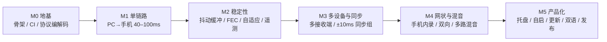

# AudioLink 开发路线图

> 起点策略（已确认）：**先打穿单链路，再叠加组网与产品化**。
> 估算口径：单人全职、含测试与调试；标 ⚠️ 的是关键路径风险项。

---

## 里程碑总览

| 里程碑 | 主题 | 规模 | 退出条件（可验收） |
|---|---|---|---|
| M0 | 地基 | S（3–5 天） | `cargo test` 全绿；协议向量 round-trip 通过；CI 能构建内核 |
| M1 | 单链路打通 | L（2–3 周） | PC → 单台 Android 出声，遥测 P50 ≤ 80 ms / P95 ≤ 100 ms |
| M2 | 稳定性与质量 | L（2–3 周） | 弱网（5 Mbps/2% 丢包/30 ms 抖动，即 **±15 ms**，见 `docs/22` §12）可听；8 h soak 无故障（**「无静音」已是可判指标**：欠载占比，阈值待产品确认，见 `docs/22` §11） |
| M3 | 多设备与同步 | M（2 周） | 3 台接收端并发；组内同步 ±10 ms（P95，双机录音验证） |
| M4 | 网状与混音 | L（2–3 周） | 手机内录 → PC；手机 → 手机；4 路混音无爆音 |
| M5 | 产品化 | M（1–2 周） | Release 产出安装包 + 绿色版 + 双 ABI APK；自动更新可用 |

---

## M0 · 地基

**目标**：把"会返工的地方"先钉死——协议、工具链、CI、测试脚手架。

**交付物**
1. `core/` workspace 骨架（8 个 crate 的空壳 + 依赖方向约束）；
2. `audiolink-types` + `audiolink-proto` **完整实现**（帧/命令/发现报文，含 `03-protocol.md` §12 全部 golden vectors）；
3. `rust-toolchain.toml`、`.cargo/config.toml`（含 Android 交叉编译目标）、`clippy` 规则（`unwrap`/`expect` 在实时路径禁用）；
4. CI：`rust-check`（fmt + clippy + test）、`android-build`、`desktop-build`（可只跑 `cargo check`）；
5. `tools/alp2-dump`：协议抓包/解码工具（调试基础设施，越早越好）；
6. `tools/latency-probe`：本机回环链路延迟测量工具（M1 验收依赖）。

**验收**
- `cargo test -p audiolink-proto` 全绿，含"截断/超长/未知类型/保留位非 0"的拒绝用例；
- 编码 → 解码 → 再编码字节一致；
- CI 在干净环境可复现通过。

**风险**：无（技术确定性高）。

---

## M1 · 单链路打通（PC → 单台 Android）

**目标**：把"采集 → 编码 → 传输 → 解码 → 播放"整条链路跑通，并把延迟压进 40–100 ms。

**交付物**
1. **Windows 采集**：WASAPI loopback（事件驱动、显式缓冲、48 kHz/f32/2ch 统一格式）——
   **口径已按实测修正（2026-09-14）**：共享模式**缓冲下限 22 ms**（1056 帧），能压到 10 ms 的是**引擎周期**
   （事件驱动每周期交付 480 帧）。M1 的采集指标因此按「周期 10 ms」验收，而不是「缓冲 10–20 ms」；
   细节与复测方法见 `docs/06-dev-environment.md` §4.2；
2. **Opus 编码**：20 ms 帧、160 kbps、VBR、in-band FEC；
3. **QUIC 通道**：quinn 端点（监听 + 发起）、控制流 #0、音频数据报；
4. **Android 播放**：Kotlin `AudioTrack` 低延迟模式（API 26+）、JNI 环缓冲、欠载检测；
5. **最小 UI**：桌面端"设备 IP 手工连接 + 开始/停止"；Android 端"服务启停 + 状态"；
6. **配对**：PIN 流程最小可用（白名单可先落盘为明文 JSON）。

**验收（真机）**
| 项 | 标准 | 方法 |
|---|---|---|
| 出声 | 连接成功 ≤ 300 ms 内出声 | 人工计时 + 遥测首帧时间 |
| 延迟 | `e2e_latency_us` P50 ≤ 110 ms、P95 ≤ 150 ms | `tools/latency-probe` + 遥测 |
| **零重采样** | 全链路 48 kHz，运行时不存在任何 SRC 环节 | 遥测显示采集/内核/播放采样率均为 48000；音频路径日志断言 |
| **低延迟模式** | Android 侧 `PERFORMANCE_MODE_LOW_LATENCY` 生效（`getPerformanceMode()` 返回值校验） | 单元/仪器测试 + 真机实测输出延迟 |
| 音质 | 无爆音、无周期性咔哒 | 1 kHz 正弦 + 粉噪主观听测 |
| 稳定性 | 30 min 连续无断流 | 记录 `underruns`/`plc_count` |
| 蓝牙提示 | 检测到蓝牙输出时 UI 明确提示延迟劣化 | 真机（蓝牙耳机/音箱） |
| 回归 | 采样率切换、设备切换不崩溃 | 手动用例 |

> 优先级：**"零重采样"与"低延迟模式"两项若未达标，不得进入 M2** —— Oboe 实测这两项分别值 ~160 ms 与 ~185 ms，是本项目最大的单点杠杆。

⚠️ **关键路径风险**：~~Windows 采集事件驱动缓冲能否稳定压到 10–20 ms~~ → **已实测关闭（2026-09-14）**：
设备缓冲下限 22 ms、引擎周期 10 ms 且稳定；Opus 编解码实测 encode 75 μs / decode 57 μs（占帧预算 < 1%）。
**自环五段分解实测 39.7 ms**（默认端点，20 ms 帧），留给网络 + Android 播放约 70 ms 预算 —— 风险已从
「采集/编解码是否可行」转移到「网络抖动 + Android 播放路径」，后者仍需真机验证。
复测：`cargo run -q -p audiolink-tools --bin self-loop -- run --seconds 20`。

---

## M2 · 稳定性与质量

**目标**：让链路"在真实网络上不炸"。

**交付物**
1. **抖动缓冲**：自适应深度（20–60 ms），水位监控与欠载处理；
2. **丢包对策**：默认冗余双发 + PCM 丢包掩盖 + NACK 重传；音乐场景关闭 Opus in-band FEC；
3. **自适应码率**：`03-protocol.md` §8 规则表落地，变更写入遥测时间线；
4. **看门狗与自愈**：无输出 2 s 重建 sink（FR-28）；断线指数退避重连（FR-27）；
5. **遥测**：`StreamStats` 全字段采集 + 桌面端遥测面板（曲线 + P50/P95）+ 日志导出；
6. **弱网测试台**：`tools/netem-sim`（或在 PC 侧用代理做丢包/抖动注入）。

**验收**
| 项 | 标准 | 方法 |
|---|---|---|
| 抗抖动 | 抖动 30 ms（**峰峰** = `--netem-jitter-ms 15`，见 `docs/22` §12）无爆音 | netem 注入 |
| 抗丢包 | 2% 随机丢包下可懂、无长断音（**静音总占比可判**；「连续静音」推不出来，属遗留，见 `docs/22` §11.5） | netem 注入 |
| 自适应 | 丢包 > 1% 时码率下降并可见 | 遥测时间线 |
| 长时 | 8 h 无崩溃/**无静音**/无漂移（「无静音」= 累计欠载 ÷ 计划总拍数，建议值 1.00%，**待产品确认**，见 `docs/22` §11） | soak 脚本 + 遥测 |
| 自愈 | 拔网 10 s 后 ≤ 3 s 恢复 | 手动断网 |
| 自愈 | 注入播放器异常后自动重建 | 故障注入开关 |

---

## M3 · 多设备与同步

**目标**：一台发送端推 N 台接收端，组内 ±10 ms。

**交付物**
1. **多会话管理**：发送端并行推流（≥ 8 目标），每会话独立统计与音量；
2. **时钟同步**：§6 全流程（探测/窗口/回归/质量分级）；
3. **预约播放**：播放环按 epoch 驱动，迟到丢弃策略；
4. **临时同步组**：勾选成组、动态加入/退出、成员同步质量展示；
5. **双机录音对齐工具**：`tools/sync-measure`（脉冲 + 波形对齐，输出偏差报告）。

**验收**
| 项 | 标准 | 方法 |
|---|---|---|
| 并发 | 3 台接收端同时推流，互不影响 | 真机 + 遥测 |
| 同步 | 组内偏差 ≤ ±10 ms（P95） | 双机同期录音 + 波形对齐 |
| 动态 | 运行中第 3 台加入，前两台不中断 | 手动用例 |
| 时钟 | 稳定后 offset 抖动 ≤ 2 ms | 遥测曲线 |

⚠️ **风险**：廉价手机晶振漂移大（±50 ppm 以上）→ 依赖 `drift_ppm` 速率微调；若某些设备硬件输出延迟差异 > 5 ms，需在设置中提供**每设备手动延迟补偿**（±50 ms 滑块）。

---

## M4 · 网状与混音

**目标**：任意节点可发可收；同一接收端多路混音。

**交付物**
1. **Android 发送**：`AudioPlaybackCapture`（API 29+）+ 麦克风路径（FR-06/07）；
2. **Windows 接收**：WASAPI render 输出（FR-08）；
3. **混音器**：多路求和 + 软限幅 + 每路增益/静音（FR-12）；
4. **能力协商与降级**：内录不支持时 UI 置灰并说明（`CAP_UNSUPPORTED`）；
5. **多路时钟对齐**：不同源的流按各自 epoch 换算到本地时钟后再混音。

**验收**
| 项 | 标准 | 方法 |
|---|---|---|
| 汇聚 | 2 部手机 → PC，PC 混音输出无爆音、可独立调音量 | 真机 |
| 反向 | PC → 手机 + 手机 → PC 同时进行 | 真机 |
| 手机互推 | Android(内录) → Android 出声 | 真机 |
| 上限 | 超过 8 路被拒并提示（`STREAM_LIMIT`） | 脚本压测 |
| 降级 | API 24–28 设备"内录"置灰并给出原因 | 真机/模拟器 |

⚠️ **风险**：`AudioPlaybackCapture` 受目标应用 `allowAudioPlaybackCapture` 限制（部分 App 禁捕获）与 DRM 限制 → UI 需明确说明"某些应用的内录不可用"，并允许麦克风兜底。

---

## M5 · 产品化

**目标**：能发给别人用。

**交付物**
1. 桌面：卡片式设备列表 + 状态仪表、托盘常驻、开机自启、窗口状态记忆、中英双语、自动更新（FR-29–34）；
2. Android：单页 UI（状态卡片 + 节点列表）、前台服务通知、开机自启、省电白名单引导、R8 混淆、双 ABI（FR-35–40）；
3. 发布流水线：tag → 构建（Windows 安装包 + 绿色版 + APK×2 ABI）→ GitHub Release → 更新清单签名；
4. 文档：用户手册（中/英）、故障排查指南、`CONTRIBUTING.md`；
5. 合规清单：`LICENSE` / `NOTICE` / 隐私说明（音频只在已配对的设备之间直连传输、不上传第三方）。
   - **落点：`docs/privacy.md`**（2026-09-17 补）。该文逐条给出代码/清单出处（采集范围、音频去向、本地落盘、有无上报、权限逐条、如何撤回），并记录两处待办：本行「不采集音频内容」的措辞与产品核心功能矛盾、「取消配对」当前没有界面出口 —— 见该文 §7。

**验收**
| 项 | 标准 |
|---|---|
| 安装 | 全新 Windows 机器安装后可用（含 WebView2 检测与引导） |
| 便携 | 绿色版解压即用，配置写用户目录 |
| Android | 分 ABI 的两个安装包（arm64-v8a / armeabi-v7a）在 API 26 与 API 34 真机均可用（minSdk = 26，见 `android/app/build.gradle.kts`） |
| 更新 | 桌面端检测到新版本并完成签名校验更新 |
| 合规 | 仓库无密钥、无第三方私有 API 调用、NOTICE 完整 |

---

## 质量保障（贯穿所有里程碑）

| 层 | 手段 |
|---|---|
| 内核单元测试 | 协议向量、抖动缓冲、时钟同步（模拟时钟）、混音、限幅 |
| 跨端契约测试 | 同一组 golden vectors 在 Rust 与 JNI 边界双跑 |
| 集成测试 | 本机回环（同进程/双进程）自动跑通全链路 |
| 网络仿真 | netem/代理注入延迟、丢包、抖动、乱序、带宽限制 |
| 长时 soak | CI nightly 8 h 回环 + 真机 24 h 稳定性（人工触发） |
| 真机矩阵 | Android 7.0 / 10 / 14 至少各一台；桌面 Win10 1809 / Win11 |
| 静态检查 | `clippy -D warnings`、Kotlin lint（空 catch 禁用）、TS strict + eslint |

---

## 明确不做（避免范围蔓延）

- 云音乐 / 音乐库 / 播放列表（不是播放器）
- 视频同步（音频延迟与视频帧对齐是另一个问题域）
- 跨公网穿 NAT（交给用户的 VPN）
- iOS / Web 端（v1）
- 灯效 / 硬件 hack
